# justdooeet! – Todo List App 📝

**justdooeet!** is a responsive, offline-capable Todo List web application built with **React** and **Vite**. It fetches data from the [DummyJSON Todos API](https://dummyjson.com) and enhances it with features like local persistence, task editing, filtering, and progress visualization.

---

## 🚀 Features

- 🔁 **Hybrid Data Source**: Fetches todos from DummyJSON API and combines them with local todos.
- ✏️ **Extended Fields**: Adds priority, description, and date fields stored in `localStorage`.
- ✅ **CRUD Operations**: Add, edit, delete, and complete todos—both online and offline.
- 🔍 **Search & Filter**: Filter todos by status (completed/incomplete) and search by text.
- 📦 **Query Caching & Offline Sync**: Uses **React Query** + **TanStack Query Persister** with `localforage`.
- 🔄 **Pagination**: Displays 10 tasks per page with navigation and mobile-friendly design.
- 🗑️ **Drag-and-Drop Delete**: Delete todos by dragging them into a trash area.
- 📊 **Progress Summary**: Visual bar showing percentage of completed vs pending tasks.
- 🧩 **Modular Design**: Uses `Dialog` modals for add/edit actions via ShadCN.
- ♿ **Accessibility**: Full keyboard navigation and ARIA support.
- 📱 **Responsive Layout**: Optimized for desktop, tablet, and mobile screens.


## 🧭 Pages Overview

`/dashboard`     Main todo list with filters, pagination, and controls 
`/todo/:id`      Detailed view of individual todo item           
 `/categories`   Manage and assign categories to todos           
 `/calendar`     Calendar-based task overview                    


## 🛠 Installation & Setup

1. **Clone the repository**:
   ```bash
   git clone https://github.com/yourusername/todo-list-app.git
   cd todo-list-app
   ```

2. **Install dependencies**:
   ```bash
   npm install
   ```

3. **Start the development server**:
   ```bash
   npm run dev
   ```

4. **View the app**:
   Open your browser and navigate to:
   ```
   http://localhost:5173
   ```

---

## 📦 Available Scripts

| Command           | Description                                 |
|------------------|---------------------------------------------|
| `npm run dev`     | Run in development mode with hot reloading  |
| `npm run build`   | Build the app for production                |
| `npm run preview` | Preview the production build                |
| `npm test`        | Run tests (if configured)                   |
| `npm run lint`    | Lint the project (if linter configured)     |

---

## 🧱 Tech Stack & Architecture

- **React + Vite** – Lightning-fast dev environment and optimized production build
- **React Router** – SPA routing
- **React Query (@tanstack/react-query)** – API caching, background refetching, state management
- **@tanstack/query-persist-client** – Persists React Query data to `localforage` for offline caching
- **localStorage** – Stores extended task fields (description, priority, etc.)
- **localforage** – Async persistent storage used with Query Persister
- **Tailwind CSS** – Utility-first styling framework
- **ShadCN UI** – Accessible and consistent UI components (e.g., `Dialog`)
- **Sonner** – Toast notifications for UX feedback
- **React DnD** – Drag-and-drop to delete tasks
- **DummyJSON API** – Simulated todo API for read/write operations

---

## 🔌 API Usage

**DummyJSON Todos API**

- `GET /todos?limit=100` – Fetch up to 100 todos
- `PUT /todos/:id` – Update todo (e.g. mark as completed)
- `DELETE /todos/:id` – Delete a todo by ID

> API data is merged with local todos, and extended fields are stored locally by `todo.id`.

---

## 🖼 Screenshots / Demos

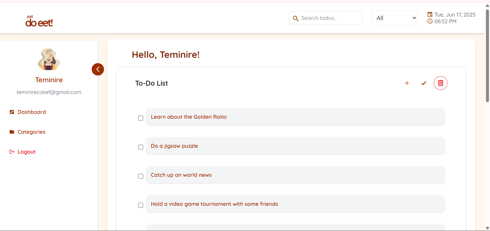
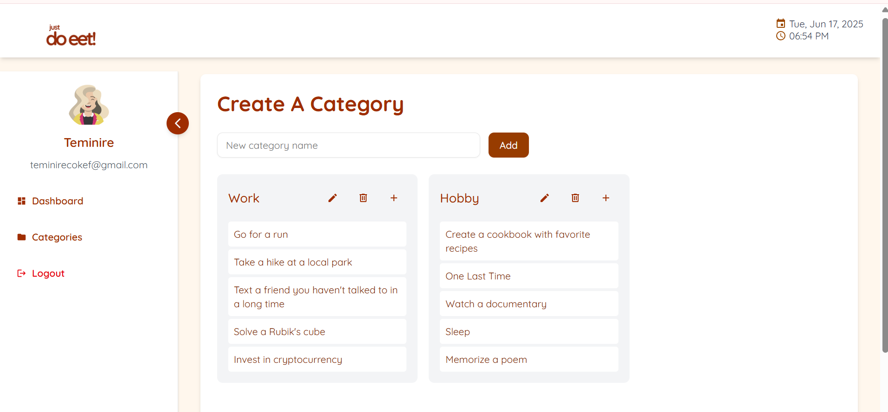
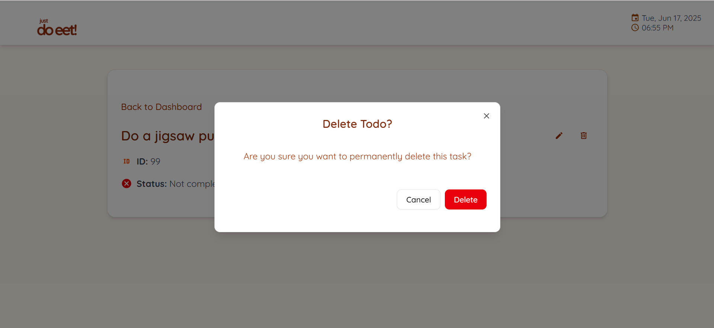
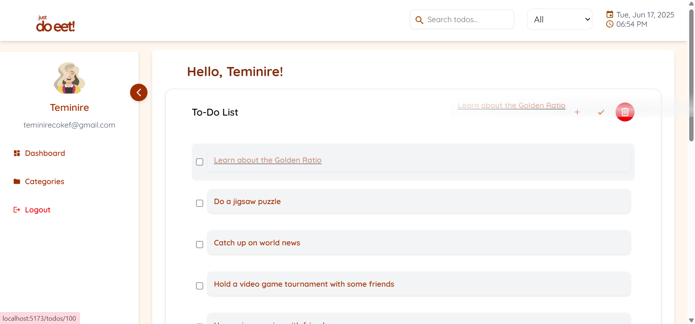
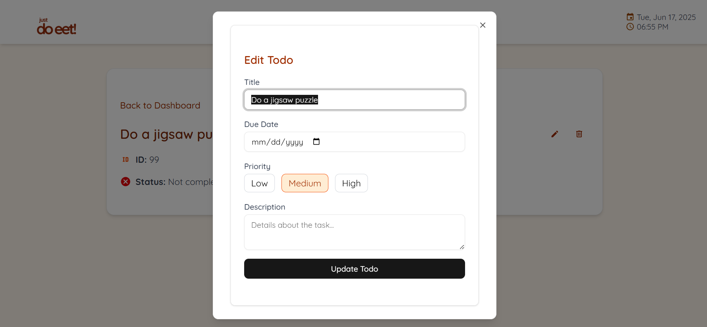
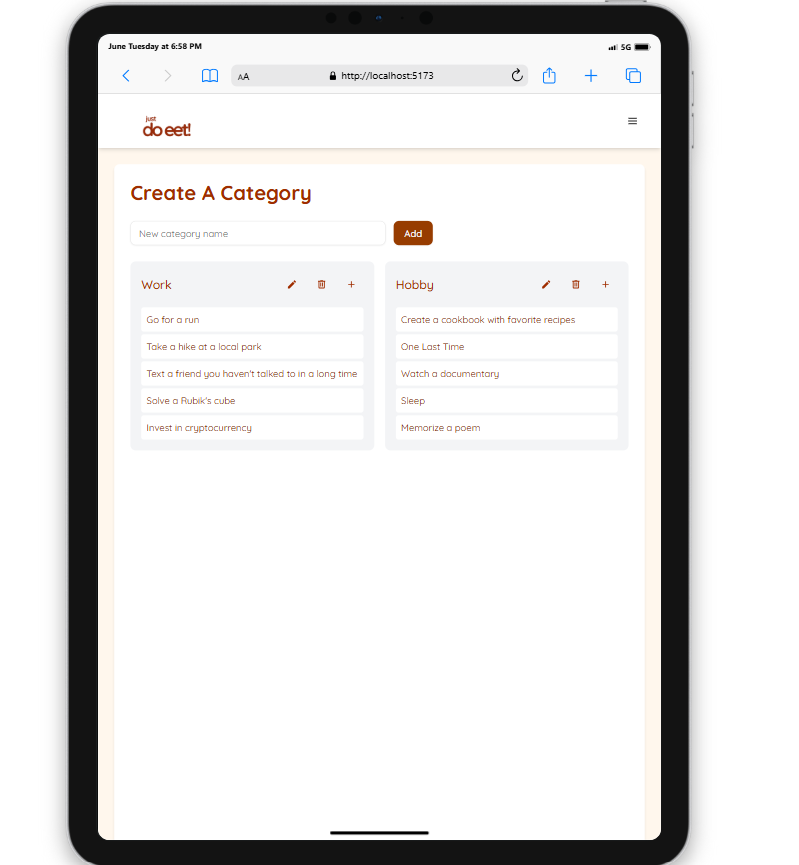
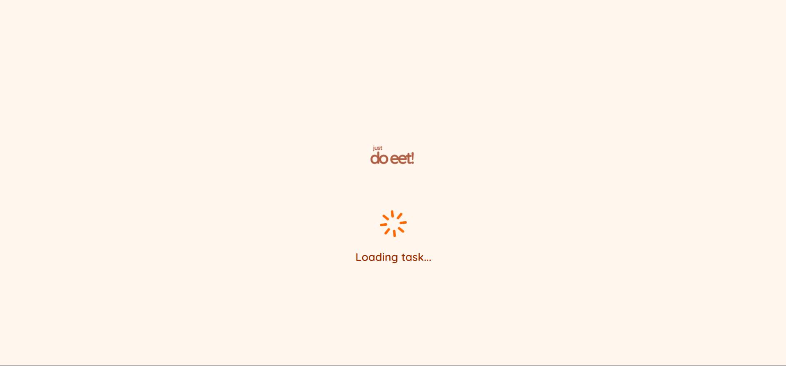
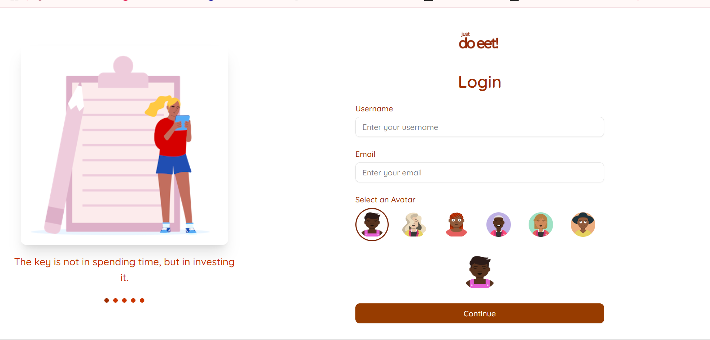
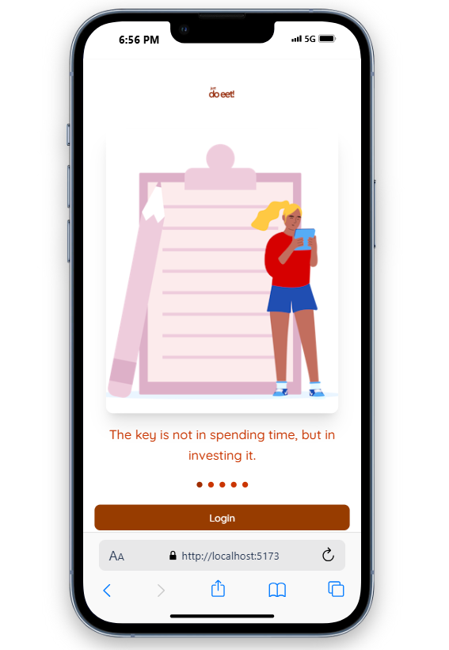
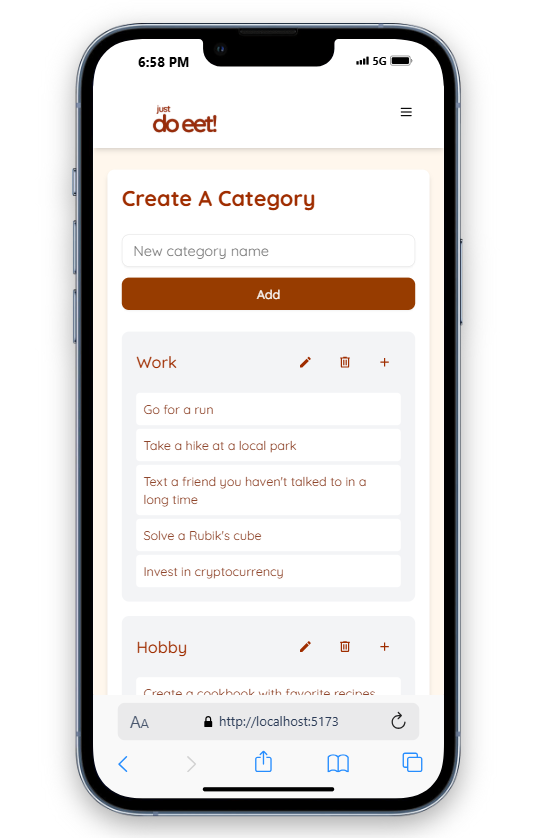
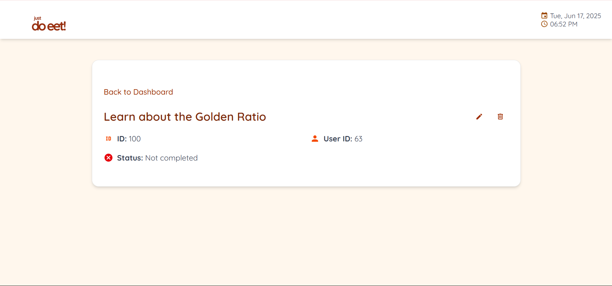


## ⚠ Known Issues / Limitations

-  **No authentication** – All data is publicly shared and session-based.
-  **API does not persist** – Changes to DummyJSON API do not persist beyond session.
-  **Offline sync is one-way** – Local changes do not auto-resync to API on reconnect.
-  **Limited filtering**
-  **Limited Mobile Responsiveness**

---

## 📅 Future Improvements

- ✅ Better offline sync between API and local storage
- 📆 Enhanced calendar/reminder system
- 📦 Installable PWA support
- 🎨 More UI illustrations and animations
- 🧭 Advanced filters (by category, priority, etc.)
- 🎹 Keyboard shortcuts and accessibility polish
- 📱 Improved mobile and tablet responsiveness
- 🔔 Push notification support for reminders

---

## ✅ Offline Availability

justdooeet! supports offline access to todos via:

- **localStorage** – Persists user-created todos and metadata.
- **localforage** + **TanStack Query Persister** – Caches fetched API todos so users can return to the app without internet.

> 🔁 Once loaded, todos remain available even after reload or disconnection.

---

## 👩‍💻 Author

> Built by Oluwatiseteminirere Coker 


